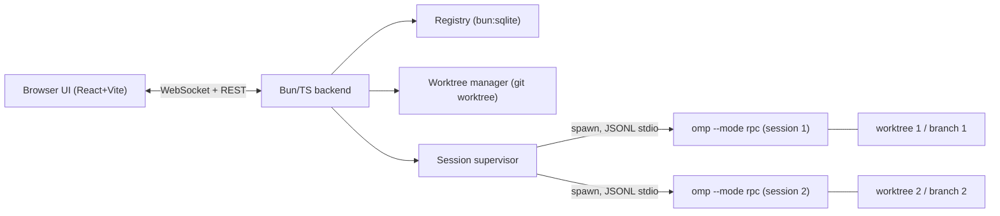

# Kermanych — omp Session Orchestrator (MVP Design)

- **Status:** Draft for review
- **Date:** 2026-08-06
- **Working name:** Kermanych (provisional; rename freely)

## 1. Purpose

A local GUI to run and supervise multiple `omp` coding-agent sessions across
several projects at once. It replaces the ad-hoc "many terminal tabs in Warp"
workflow with project-grouped, task-oriented sessions whose live execution
stage is visible at a glance.

This is an **orchestration shell around an existing agent**, not a new agent.
All intelligence stays in `omp`; Kermanych launches it, observes it, and lets the
user steer it.

## 2. Goals (MVP)

1. **Grouping.** Sessions are grouped by project. A group is bound to one
   project directory (a git repo).
2. **Parallel sessions per group.** Launch several sessions inside a group,
   each isolated in its own git worktree + its own `omp` process.
3. **Visual session state.** Each session shows a live stage derived from the
   `omp` RPC event stream: `queued → thinking → running tool → waiting for
   input → done / error`, plus live todo progress and context usage.
4. **Drill-in control.** Open a session to read its streaming transcript,
   answer approval/input prompts, and send follow-up or steering messages.

## 3. Non-goals

**Post-MVP (planned, not in this spec):**
- `/tree` view — visualize and navigate a session's *conversation branch tree*
  (from JSONL `id`/`parentId`; drive with RPC `branch`). Note: this is
  in-session branch navigation, **not** git worktrees.
- Diff review + merge of a session's worktree branch back to the base branch.
- Subagent-tree visibility (`set_subagent_subscription` / `get_subagents`).
- Desktop packaging (Tauri) reusing the same web frontend.
- Desktop/system notifications on state changes.

**Out of scope entirely:** building an agent/model, multi-user/remote hosting,
auth management (`omp` owns its own credentials).

## 4. Key finding: the omp integration surface

`omp` (v17.2.9) exposes a first-class external interface, so Kermanych never
parses a terminal.

- **`omp --mode rpc`** — newline-delimited JSON over stdio. Commands in
  (`prompt`, `steer`, `follow_up`, `abort`, `new_session`, `get_state`,
  `get_messages`, `switch_session`, `branch`, `extension_ui_response`, …);
  events out (`agent_start`, `turn_start`, `tool_execution_start/end`,
  `message_update`, `agent_end` with `isTerminal`, `extension_ui_request`, …).
- **`get_state`** returns `isStreaming`, `contextUsage.percent`, `model`,
  `sessionId`, `sessionFile`, and **`todoPhases`** (live task list with
  per-task status) — the richest possible "what stage is it at" signal.
- **Sessions already grouped on disk** under
  `~/.omp/agent/sessions/<scope>-<project>-<sha256(cwd)>/<ts>_<id>.jsonl`, with
  listing helpers that report lifecycle status.
- **Worktrees are a native concept** (`omp worktree`, `~/.omp/wt`). Kermanych
  manages its own worktrees via plain `git worktree` for full control.
- **Client libraries exist:** a TypeScript `RpcClient` in the omp package and a
  Python `omp-rpc` package. Fallback: speak the documented JSONL protocol
  directly (small, versioned, v2 chunking for large frames).

## 5. Architecture

Local web app: a Bun/TypeScript backend supervises one `omp --mode rpc` child
per session and pushes normalized state to a browser frontend over WebSocket.



### Components

- **RpcSession** — wraps one child process: spawn `omp --mode rpc --cwd <wt>`,
  negotiate protocol v2, correlate command ids, decode/reassemble frames, emit
  typed events. Thin wrapper over the documented protocol (or the bundled TS
  client if importable).
- **Session supervisor** — owns the set of `RpcSession`s. Maps raw RPC events
  to the normalized `SessionStatus` model, buffers the transcript, and forwards
  approval/input requests to the UI. Handles child crash/exit.
- **Worktree manager** — `git -C <projectDir> worktree add <wtPath> -b <branch>`
  on create; `worktree remove` on delete. Worktrees live under
  `~/.kermanych/worktrees/<sessionId>`; branches named `kermanych/<session-slug>`.
- **Registry** — `bun:sqlite` store of groups and session metadata (pointers to
  omp's session file + worktree path). omp owns transcript persistence; Kermanych
  stores only pointers and its own status.
- **Web API** — REST for CRUD (groups, sessions) + a WebSocket channel that
  streams state deltas and transcript appends, and carries prompt/steer/answer
  commands back down.
- **Frontend** — React + Vite + Tailwind. No terminal emulator needed: the
  transcript is structured events rendered as a chat-style log.

## 6. Data model

```ts
type Group = {
  id: string;
  name: string;
  projectDir: string;   // absolute path to a git repo
  createdAt: string;
};

type SessionStatus =
  | "queued"        // created, first prompt not yet streaming
  | "thinking"      // agent turn streaming
  | "tool"          // executing a tool (see currentTool)
  | "waiting_input" // extension_ui_request pending (approval/input)
  | "done"          // agent_end isTerminal; idle, ready for follow-up
  | "error"         // child crashed or fatal RPC error
  | "stopped";      // user-stopped

type Session = {
  id: string;
  groupId: string;
  name: string;
  task: string;               // initial prompt
  worktreePath: string;
  branch: string;
  ompSessionId?: string;      // from get_state
  ompSessionFile?: string;    // from get_state
  status: SessionStatus;
  currentTool?: string;
  todoPhases?: TodoPhase[];   // mirrored from get_state
  contextPercent?: number;
  pendingUiRequest?: RpcExtensionUIRequest; // when waiting_input
  createdAt: string;
};
```

## 7. Session lifecycle

1. **Create group** — user picks a project directory; Kermanych verifies it is a
   git repo and records the group.
2. **Create session** — user types a task and (optionally) a model. Kermanych:
   - derives a branch name `kermanych/<slug>`;
   - `git worktree add ~/.kermanych/worktrees/<id> -b <branch>` from the group repo;
   - spawns `omp --mode rpc --cwd <worktreePath> [--model <m>]`;
   - waits for the `ready` frame, negotiates protocol v2;
   - sends `{ type: "prompt", message: <task> }`.
3. **Run** — supervisor consumes events, updates `status`/`currentTool`/
   `todoPhases`/`contextPercent`, appends transcript, and broadcasts deltas.
   Periodic (or on-demand) `get_state` refreshes context %/todos.
4. **Waiting input** — on `extension_ui_request`, status → `waiting_input`; the
   request is surfaced in the UI. The user's answer is sent back as
   `extension_ui_response`.
5. **Done** — on `agent_end` (`isTerminal !== false`), status → `done`. User can
   send `follow_up`/`steer`, stop, or (post-MVP) review the diff.
6. **Stop / delete** — stop closes stdin (graceful RPC shutdown) and keeps the
   worktree for inspection; delete also `git worktree remove`s it.

## 8. State model (RPC event → status)

| RPC signal | Resulting status |
| --- | --- |
| created, before first stream | `queued` |
| `agent_start` / `turn_start` / `message_update` | `thinking` |
| `tool_execution_start` | `tool` (+ `currentTool = toolName`) |
| `tool_execution_end` | back to `thinking` |
| `extension_ui_request` (confirm/input/select) | `waiting_input` |
| `extension_ui_response` sent | back to prior status |
| `agent_end` with `isTerminal !== false` | `done` |
| child exit ≠ 0 / fatal parse loop failure | `error` |
| user stop | `stopped` |

`get_state` supplies `contextPercent` (`contextUsage.percent`), `todoPhases`,
`model`, `ompSessionId`, `ompSessionFile` regardless of status.

## 9. UI

- **Left sidebar:** groups (projects). Add-group button. Per group, a count of
  sessions by status.
- **Main area (group selected):** a board of session cards. Each card shows
  name, status badge (color-coded), current tool or current in-progress todo,
  and context %. "New session" launcher (task textarea + model picker).
- **Session detail (card opened):** streaming chat-style transcript; an input
  box that sends `prompt`/`follow_up`/`steer` depending on state; an inline
  answer widget when `waiting_input` (renders the `extension_ui_request` —
  confirm/select/input). Stop / delete controls.

## 10. Tech stack

- **Backend:** Bun + TypeScript. `Bun.spawn` for children, `bun:sqlite` for the
  registry, `Bun.serve` for REST + WebSocket. No heavy framework.
- **Frontend:** React + Vite + Tailwind. State via a small store (Zustand or
  React context); WebSocket client for live updates.
- **omp:** invoked as `omp --mode rpc` per session; protocol per
  `omp://rpc.md`.

## 11. Error handling

- Child spawn failure / non-git group dir → surfaced at create time, session
  not created.
- Child crash mid-run → `error` status, last stderr captured and shown; a
  "relaunch" action can `switch_session`/`resume` the persisted omp session
  file in a fresh child.
- RPC command failures are recoverable (process stays alive); malformed frames
  do not kill the loop.
- Worktree conflicts (branch exists) → suffix the slug; report if unrecoverable.

## 12. Verification

Smoke test, not unit-first (MVP is an integration shell):

1. Start backend + frontend.
2. Create a group on a real git repo.
3. Launch a session with a trivial task (e.g. "list top-level files, then stop").
4. Observe status transitions `queued → thinking → tool → done` in the UI.
5. Launch a task that triggers an approval; confirm `waiting_input` appears and
   answering from the UI unblocks the agent.
6. Launch two sessions in one group; confirm isolated worktrees and independent
   state.

Targeted unit tests only for pure logic (event→status mapping, worktree naming).

## 13. Risks & open questions

- **TS `RpcClient` import path** — confirm it is exported by the published
  package; fallback is the raw JSONL protocol (documented, low risk).
- **Approval round-trip** — the `extension_ui_request`/`extension_ui_response`
  flow must be validated against a real approval prompt (milestone 4).
- **Non-git project dirs** — MVP requires git (worktree isolation was the chosen
  model). A "no-isolation, run in dir" fallback is deferred.
- **Model/auth** — Kermanych relies on omp's existing auth; if no model is
  authenticated, session creation should fail clearly.

## 14. Milestones (implementation order)

1. **Spike:** backend spawns one `omp --mode rpc`, sends a prompt, prints the
   event stream. Proves the integration end to end.
2. **State core:** event→status mapping, transcript buffer, `get_state` polling.
3. **Web API:** REST CRUD + WebSocket deltas.
4. **Frontend:** group sidebar + session board with live status.
5. **Session detail:** transcript view, input box, approval/input widget.
6. **Worktrees:** per-session `git worktree` create/remove.
7. **Persistence + resilience:** `bun:sqlite` registry, crash/relaunch handling.

Post-MVP milestones (separate specs): `/tree` navigator, diff/merge review,
desktop packaging.
